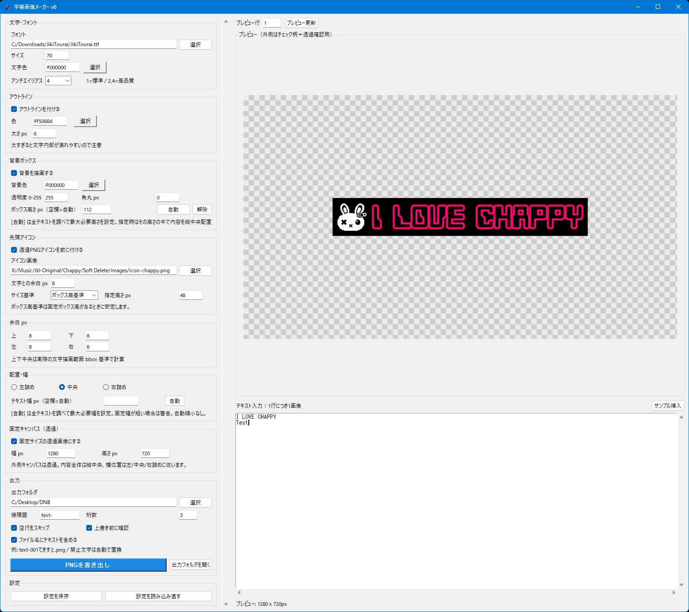

# 字幕画像メーカー



## 機能概要

字幕画像メーカーは、動画編集ソフトで使う字幕用PNG画像をまとめて生成するPython製GUIツールです。
1行のテキストにつき1枚の字幕画像を出力できるので、字幕の位置・サイズ・背景ボックスをきれいに揃えたいときに便利です。

### 主な機能

* Python / Tkinter製のGUIツール
* 複数行テキストから、1行につき1枚のPNG画像を連番出力
* フォントファイル指定に対応
* 文字色、アウトライン色、アウトライン太さを指定可能
* 背景ボックスの色、透明度、角丸、余白を調整可能
* 固定キャンバスサイズの透過PNG出力に対応
* 背景ボックス高さの固定指定に対応
* 全テキストを調べて、最大ボックス高さを自動設定可能
* 全テキストを調べて、最大テキスト幅を自動設定可能
* 左詰め、中央揃え、右詰めに対応
* テキストの前に透過PNGアイコンを追加可能
* アイコンサイズを文字高基準、ボックス高基準、指定pxから選択可能
* ファイル名にテキスト内容を含めるオプションあり
* ファイル名に使えない禁止文字は自動で置換
* プレビュー機能あり
* 設定保存あり

### 一言で言うと

「動画用の字幕PNGを、きっちり揃えてまとめて作るツール」

## 使い方

1. **アプリを起動する**

   事前に必要ライブラリをインストールしてください。

   ```bash
   pip install pillow
   ```

   そのあと、ターミナルで以下を実行します。

   ```bash
   python subtitle-image-maker-v6.py
   ```

2. **ファイルを読み込む**

   必要に応じて、以下のファイルを参照ボタンから指定します。

   * フォントファイル
     `.ttf`, `.otf`, `.ttc`
   * 先頭アイコン画像
     `.png`, `.webp`, `.jpg`, `.jpeg`, `.bmp`, `.gif`

   透過PNGアイコンを使うと、字幕の前にキャラアイコンや話者アイコンを付けられます。

3. **設定を行う**

   主な設定項目は以下です。

   * フォントサイズ
   * 文字色
   * アウトラインのON/OFF
   * アウトライン色
   * アウトライン太さ
   * 背景ボックスのON/OFF
   * 背景色
   * 背景透明度
   * 角丸
   * 上下左右の余白
   * 左詰め、中央揃え、右詰め
   * テキスト幅px
   * ボックス高さpx
   * 固定キャンバスサイズ
   * 先頭アイコンの有無
   * アイコンサイズ基準
   * 出力フォルダ
   * ファイル名の接頭語
   * 連番桁数
   * ファイル名にテキストを含めるかどうか

   ボックス高さとテキスト幅は、`自動` ボタンで全テキストを調べて最大値を設定できます。

4. **プレビューを確認**

   プレビュー欄で、現在の字幕画像を確認できます。
   外側のチェック柄は透過確認用です。

5. **PNGを書き出す**

   `PNGを書き出し` ボタンを押すと、入力テキストの各行をPNG画像として出力します。

   例:

   ```text
   text-001.png
   text-002.png
   text-003.png
   ```

   「ファイル名にテキストを含める」をONにした場合は、以下のようなファイル名になります。

   ```text
   text-001I looked at you wrong.png
   text-002The machine learned shame.png
   ```

   ファイル名に使えない文字は、自動で `_` に置換されます。

## おすすめ設定例

動画編集ソフトで字幕サイズを揃えたい場合は、以下の設定がおすすめです。

* 固定キャンバス: ON
* キャンバス幅: 動画サイズに合わせる
  例: `1920`
* キャンバス高さ: 字幕エリアに合わせる
  例: `180`
* ボックス高さ: `自動` で設定
* テキスト幅: `自動` で設定
* アイコンサイズ基準: ボックス高基準
* 配置: 中央

これで、字幕ごとの画像サイズやボックス高さが揃いやすくなります。

## 必要環境

* Python 3.10以上
* Pillow
* Tkinter
  ※通常のPythonには標準で含まれています

pip install例:

```bash
pip install pillow
```

## ライセンス

**MIT License** で公開しています。
ご自由に使って、改変して、参考にしてください。
ただし**自作発言はNG**でお願いします。
